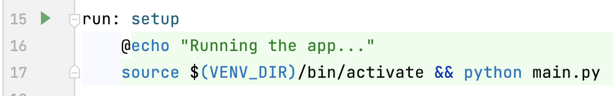
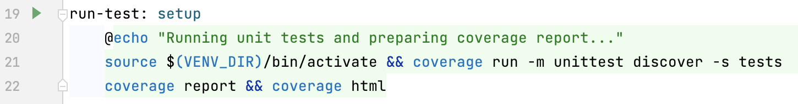
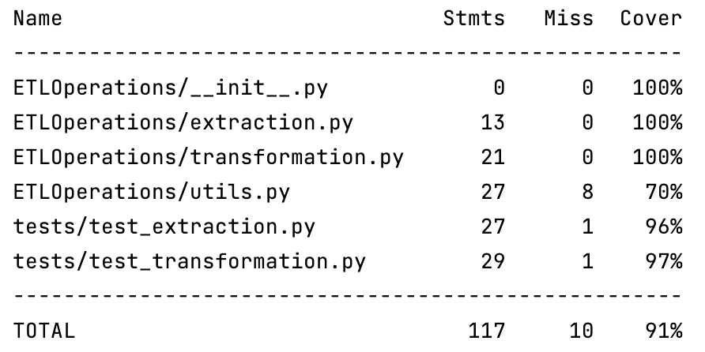
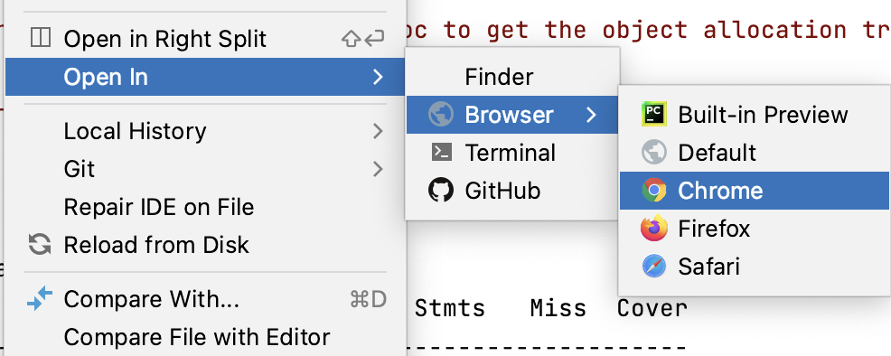
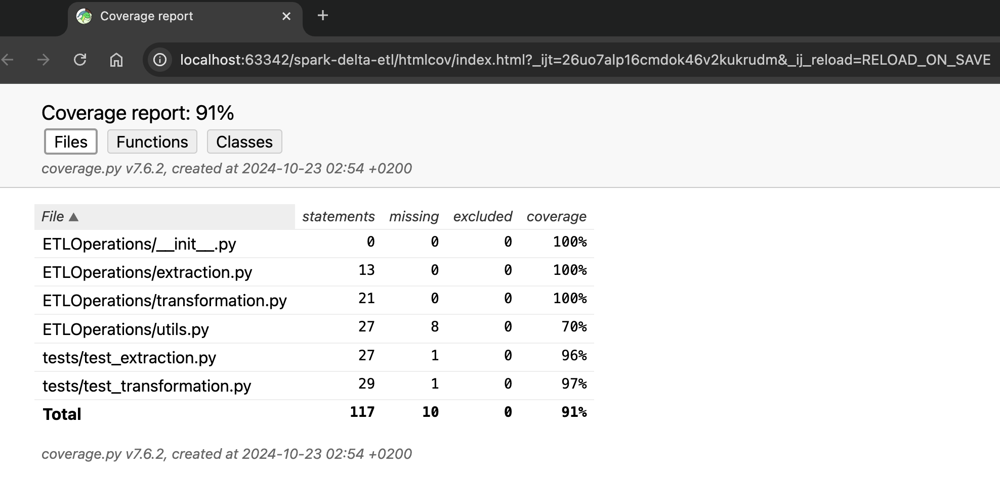
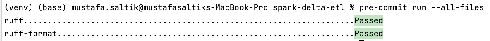

# spark-delta-etl

## Table of Contents

- [Project Overview](#project-overview)
- [Project Structure](#project-structure)
- [Prerequisites](#prerequisites)
- [Installation](#installation)
- [Running the project](#running-the-project)
- [Testing and Test Coverage](#testing-and-test-coverage)
- [Code Styling](#code-styling)
- [Error Handling](#error-handling)
- [Next Steps](#next-steps)


## Project Overview
This project implements an ETL (Extract, Transform, Load) data pipeline using PySpark. The pipeline extracts data from CSV files, performs transformations, and loads the processed data in delta formats for analysis and reporting. It includes error handling, data enrichment, and aggregation steps to ensure data quality and support data-driven insights.

## Project Structure

The project is organized into the following structure:

```
project/
├── ETLOperations/
│   ├── __init__.py            # 
│   ├── extraction.py          # Code for data extraction
│   ├── transformation.py      # Code for data transformation
│   ├── utils.py               # Utility functions (e.g., error handling)
├── htmlcov/
│   ├── ...
│   ├── index.html             # Test coverage html report to visualize test results on browser
│   ├── ...
├── input/
│   ├── ...
│   ├── ...                    # Input files
├── tests/
│   ├── test_extraction.py     # Unit tests for extraction module
│   ├── test_transformation.py # Unit tests for transformation module
├── .gitignore                 # Files and folders which shouldn't be committed to remote
├── .pre-commit-config.yaml    # pre-commit hooks
├── config.yaml                # Configuration file for specifying input and output paths
├── main.py                    # Main script to run the ETL pipeline
├── Makefile                   # Makefile for automating tasks
├── README.md                  # this file
├── requirements.txt           # Python dependencies required for the project
```

## Prerequisites

Ensure you have the following installed:
- Python 3.10 or later
- Java 8 or later (required for Spark)

## Installation

**Clone the Repository:**
   ```bash
   git clone git@github.com:mustafasaltik/spark-delta-etl.git
   cd spark-delta-etl/
   ```

## Running the Project
- From terminal : ```make run```
- Or using MakeFile; just click to the run button next to the **run**



It will;
1. Create virtual environment
2. Upgrade pip and install all the requirements mentioned in the requirements.txt
3. Activate virtual environment
4. Run the main.py

## Testing and Test Coverage
- From terminal : ```make run-test```
- Or using MakeFile; just click to the run button next to the **run-test**



Once you run the tests, you can see the report; 

1. From the terminal like below:



2. From the browser with opening ```htmlcov/index.html``` like below:



And it'll be available to investigate which parts have been covered by unit tests:




## Code Styling
- We are utilizing Ruff, and it's configured as pre-commit hooks(```.pre-commit-config.yaml```).
- ```pre-commit run --all-files```



## Error Handling

We have a decorator designed to handle errors and raise exceptions with specific error codes. This is extendable strategy which we can continue to add specific exceptions and new error codes with new features in the project. It also provides additional logging mechanism to make function calls visible with its parameters.
- Check ```ETLOperations/utils.ErrorHandler```


## Next Steps

- CI/CD
  * Automate Unit Tests with GitHub Actions 
    * Use GitHub Actions to run unit tests and generate test coverage reports on every code push.
- Deployment to the Cloud for ex: Google Cloud Platform (GCP)
    * Create a GKE Cluster on GCP. 
    * Set up Google Cloud credentials in GitHub Actions to deploy to GKE.
- Set Up Monitoring and Alerting
- Separate staging and transformation layer 
- Data modelling (fact and dimension)
- Automated data quality checks
- Exception handling can be improved with using more detailed error messages using custom exceptions
- Incremental logic should be applied for both extraction and transformation layer (to not process entire data on every run)